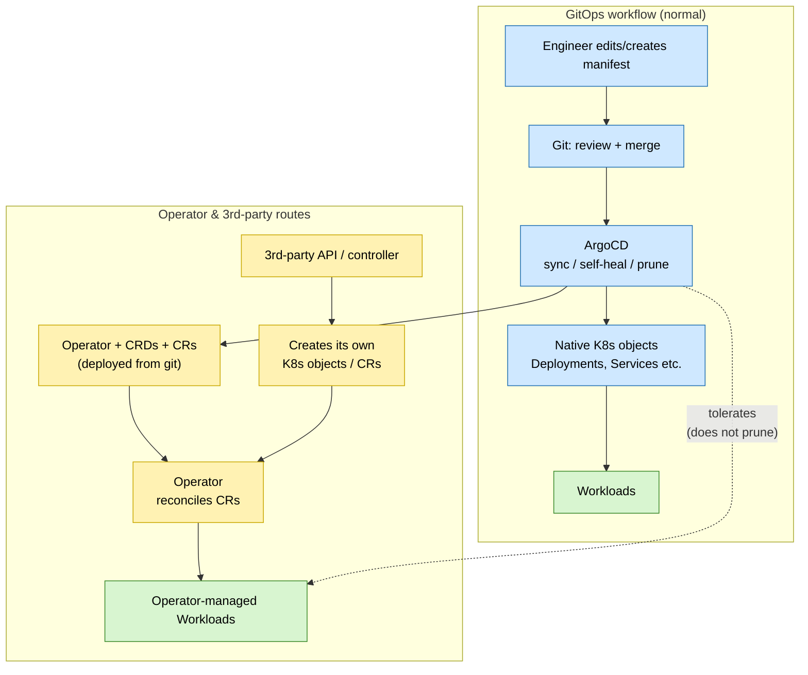

<!-- Implementation notes:
- ArgoCD (v3.4.5 / chart 10.1.3) is the single GitOps engine, installed once by the ansible argocd role, which also creates the 'infra' AppProject, registers the git repo, and applies the app-of-apps bootstrap; after that, the cluster state is driven entirely from git.
- App-of-Apps root: gitops/apps/app-of-apps recurses gitops/apps/ (directory.recurse=true) so simply adding a new app folder makes ArgoCD discover and manage it; a parallel app-of-projects does the same for gitops/projects/.
- Multi-source Helm pattern per app (e.g. grafana): sources[0]=upstream chart (pinned version) with valueFiles pointing at $values, sources[1]=this git repo ref:values supplying compute-cluster/gitops/apps/<app>/values.yml, sources[2]=this git repo path compute-cluster/gitops/components/<app> for custom manifests — cleanly separating upstream chart, our values, and our extra resources.
- Everything targets the in-cluster API (https://kubernetes.default.svc), branch compute_cluster; the 'infra' AppProject is intentionally permissive (sourceRepos '*', all destinations, cluster resource whitelist '*') since this is a single-tenant infra project.
- Sync policy is automated with prune=true + selfHeal=true (drift is auto-corrected), plus CreateNamespace=true and ServerSideApply=true on the workload apps to handle large CRDs/field ownership.
- Human-in-the-loop is enforced by process, not tooling: agents only edit local files under gitops/; humans review, commit, and push to compute_cluster, then sync in ArgoCD. Agents never push to git or mutate the cluster directly.
- Secrets stay out of git via HashiCorp Vault Secrets Operator: each namespace needing secrets gets a vault-auth-<namespace>.yml (VaultConnection + ServiceAccount + VaultAuth static-auth + RBAC) and VaultStaticSecret objects sync material from Vault mount isis-compute-cluster at runtime.
- Rationale: git is the single source of truth with automated reconciliation and self-healing, while the review-gated push flow and Vault integration keep changes auditable and secrets never committed.
-->
# 6. Gitops and ArgoCD

Date: 2026-09-10
## Status

First Draft

## Context

With the base platform in place (ADR 0005), the cluster needs to run a growing set of applications, and we need a consistent, repeatable way to define, deploy, and manage them. Applying manifests by hand with `kubectl` does not scale: it drifts from what is documented, leaves no clear audit trail, and makes recovery or rebuilds hard to reproduce.

What we want from how we deploy and manage the cluster:

- a single source of truth for cluster state, versioned and reviewable
- automated reconciliation, so the cluster converges on the declared state and self-heals drift
- a clear change-control path: every change is reviewed before it reaches the cluster
- easy onboarding of new applications without bespoke wiring each time
- secrets kept out of the source repository entirely.

## Decision

We will adopt GitOps as the way the cluster is managed, with git as the single source of truth and ArgoCD as the engine that reconciles the cluster to it:

- Source of truth: most cluster and application definitions live in git, and ArgoCD continuously reconciles the cluster to them with automated sync, self-heal, and pruning.
- Structure: an app-of-apps pattern discovers and manages applications automatically, so onboarding a new app just means adding its definition. The concrete per-application packaging and edge-routing convention that sits on top of this engine is defined in ADR 0008.
- Secrets: kept out of git and delivered at runtime from an external secret store.
- Operators and CRDs: where appropriate, complex or stateful software is managed through Kubernetes-native operators and their CRDs, this would be helpful to allow 3rd party software, for example IBEX, to spin up workloads as needed.
  - We deploy the operator and CRDs from git, then declare custom resources (CRs) for the software we want; the operators can reconcile those into the underlying pods, services, and volumes.
  - Not every running object comes directly from git: operators and third-party APIs create their own objects, so ArgoCD must tolerate these rather than prune them as drift.

The two resulting routes for getting software running — the normal GitOps path, and the operator / third-party path where objects are created in-cluster — are shown below:

## Consequences

The cluster becomes reproducible and self-documenting: its desired state lives in git, drift is corrected automatically, and rebuilds or recovery come down to re-applying what git already describes.

The trade-offs:

- Git becomes the control plane for changes, so nothing reaches the cluster without a review-and-merge step. This gives a full audit trail but adds latency to changes and rules out quick manual `kubectl` fixes as a normal practice.
- ArgoCD and its reconciliation model become a core dependency to run and understand; a misconfigured sync (e.g. over-eager pruning) can remove resources it should have left alone.
- Not everything running is directly declared in git: operators and third-party APIs could create their own objects, so the live cluster is a mix of git-owned and controller-owned resources, and ArgoCD must be scoped to tolerate the latter.
- Keeping secrets out of git means a runtime secret store (and its operator) is now on the critical path for deploying and running workloads.
