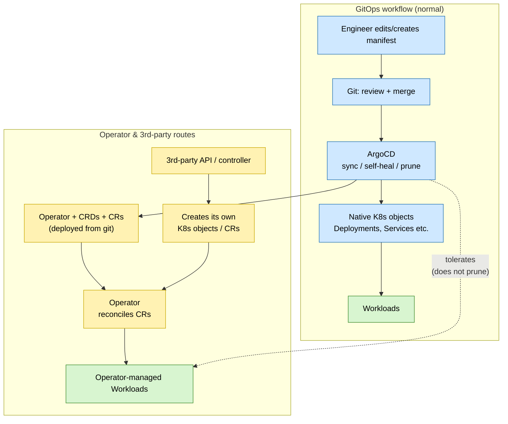

# 6. Gitops and ArgoCD

## Context and Problem Statement

The base platform (ADR 0005) now needs to run a growing set of applications. Applying manifests by hand with `kubectl` drifts from what is documented, leaves no audit trail, and is hard to reproduce. How should cluster state be managed so it is versioned, reviewable, self-healing, and easy to extend, without secrets ending up in the repository?

## Decision Drivers

* A single source of truth for cluster state, versioned and reviewable.
* Automated reconciliation that self-heals drift.
* A clear change-control path and trivial rollback of changes.
* Easy onboarding of new applications without bespoke wiring each time.
* Secrets kept out of the source repository entirely.

## Considered Options

Deployment / reconciliation engine:

* ArgoCD (pull-based GitOps)
* Flux CD (pull-based GitOps)
* Manual `kubectl`/`helm` (no GitOps)
* Jenkins/CI push (push-based delivery)

Secret management:

* HashiCorp Vault via the Vault Secrets Operator (VSO)
* Sealed Secrets (encrypted secrets committed to git)
* Plain Kubernetes Secrets committed to git

## Decision Outcome

Chosen options: **"ArgoCD"** as the GitOps engine and **"HashiCorp Vault via the Vault Secrets Operator (VSO)"** for secrets. Git is the single source of truth; ArgoCD reconciles the cluster to it with automated sync, self-heal, and pruning.

* An app-of-apps pattern discovers and manages applications automatically, so onboarding an app is just adding its definition. The per-application packaging convention is defined in ADR 0008.
* Secrets stay out of git and are delivered at runtime by Vault via VSO.
* Complex or stateful software is managed via operators and CustomResourceDefinitions (CRDs) as an example IBEX's IOCs and other instrument specific software: we deploy the operator and CRDs from git, then declare CustomResources (CRs). Because operators and third-party APIs create their own objects, ArgoCD must tolerate these rather than prune them as drift.

The normal GitOps path and the operator / third-party path are shown below:

### Consequences

* Good, because desired state lives in git, drift is auto-corrected, and rebuilds/recovery reduce to re-applying what git describes.
* Good, because every change is reviewed and merged before it reaches the cluster, giving a full audit trail and easy rollback.
* Bad, because the review gate adds latency and rules out quick manual `kubectl` fixes as normal practice.
* Bad, because ArgoCD and Vault become core dependencies; a misconfigured sync (e.g. over-eager pruning) can remove resources it should not.

### Confirmation

`kubectl get applications -n argocd` (and the ArgoCD UI) show sync/health; the app-of-apps root reconciles everything under `gitops/apps/`. Self-heal reverting manual drift confirms reconciliation. Secrets appear in-namespace via `VaultStaticSecret` while remaining absent from the repository.

## Pros and Cons of the Options

### Deployment / reconciliation engine

#### ArgoCD (Chosen option)

* Good, because pull-based sync/self-heal/prune plus a health UI, with app-of-apps reduces onboarding overhead.
* Good, because it can tolerate operator- and API-created objects rather than pruning them.
* Neutral, because it is a core component to run, understand, and secure.

#### Flux CD

* Good, because it is also mature pull-based GitOps with strong Helm/Kustomize support.
* Bad, because it offers no clear advantage here, and its CRD-driven, UI-less model fits our workflow less well than app-of-apps.

#### Manual `kubectl`/`helm` (no GitOps)

* Bad, because it drifts, leaves no audit trail, and is hard to reproduce, i.e. the problem we are solving.

#### Jenkins/CI push (push-based delivery)

* Bad, because push delivery has no continuous reconciliation or self-heal, needs cluster credentials in CI, and has weaker audit/rollback.

### Secret management

#### HashiCorp Vault via the Vault Secrets Operator (VSO) (Chosen option)

* Good, because secrets never enter git, are delivered at runtime, and rotate centrally in Vault, reusing the existing ISIS Vault.
* Bad, because Vault and its operator become a critical dependency for deploying and running workloads.

#### Sealed Secrets

* Good, because encrypted secrets can live in git.
* Bad, because rotation/re-encryption is manual, the controller key is a single critical secret, and it ignores the existing central Vault.

#### Plain Kubernetes Secrets committed to git

* Bad, because Secrets are only base64-encoded, so committing them exposes credentials in history — unacceptable.
