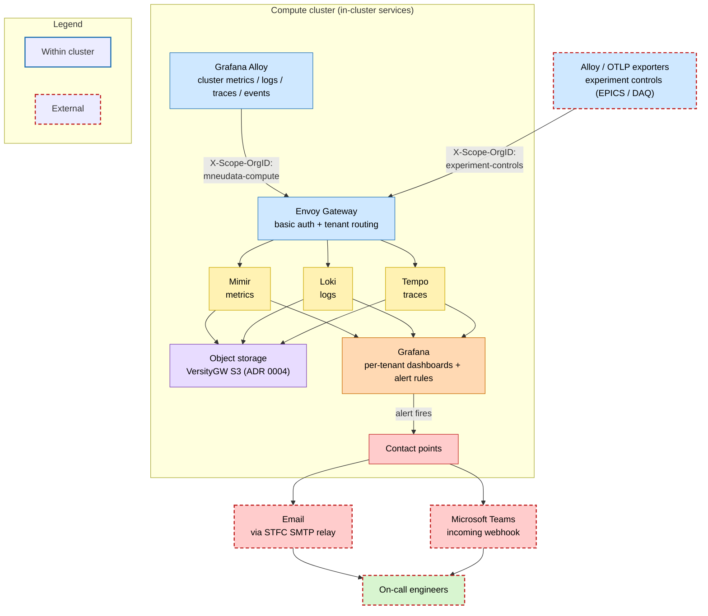

# 7. Monitoring and alerting

## Context and Problem Statement

The cluster and its workloads need to be observable metrics, logs, and traces, with alerting for incident notification/investigation without a separate tool per signal. What observability stack should we run, where should it live, and how should telemetry be collected and stored so signals correlate in one place, stay reachable during a beam cycle, isolate tenants, and stay affordable at scale?

## Decision Drivers

* Unified correlation: logs, metrics, and traces in one place, not three disconnected tools.
* Self-hosted and on-network: telemetry stays on our own infrastructure, resilient and reachable during a beam cycle (as with storage in ADR 0004).
* Multi-tenancy: teams and software share the stack with their data isolated.
* Scale and cost control: scalable stores on "object" storage (ADR0004 covers this), with retention and cardinality managed.
* Existing in-house experience: LGTM components are already hosted and maintained within ISIS, so the operational burden is a known quantity.

## Considered Options

Overall approach:

* Self-hosted Grafana LGTM stack (on the ISIS network)
* Self-hosted Elastic Stack (ELK: Elasticsearch + Kibana + Beats/APM)
* SaaS observability (e.g. Grafana Cloud, Datadog)
* A wider STFC-central monitoring service (outside the ISIS network)

Metrics store:

* Mimir
* Plain Prometheus
* Thanos
* VictoriaMetrics

Logs store:

* Loki
* ELK/EFK (Elasticsearch)

Traces store:

* Tempo
* Jaeger

Collection agent:

* Grafana Alloy
* OpenTelemetry Collector
* Prometheus (server scrape / agent mode)
* Fluent Bit
* Promtail

## Decision Outcome

Chosen option: **"a self-hosted Grafana LGTM stack"**, fed by Grafana Alloy collectors and stored on our own object storage — specifically **Mimir** (metrics), **Loki** (logs), **Tempo** (traces), **Grafana** (dashboards + alerting), and **Alloy** (collection).

* Multi-tenancy: each tenant is separated by a per-tenant org ID on ingest and query.
* Storage: telemetry blocks live on our own S3 (VersityGW), backed by ISIS' SMB storage (ADR 0004).
* Operational experience: ISIS already hosts and maintains LGTM components elsewhere (these could and probably should be merged here), so self-hosting builds on existing in-house expertise rather than starting cold.
* Alerting: Grafana alerts to email (STFC SMTP relay) and Microsoft Teams, but is not limited to this, and could support PagerDuty as used by Accelerator Controls.

SaaS (Grafana Cloud, Datadog) was rejected because it moves telemetry off-site with large recurring costs. A wider STFC-central monitoring service (outside the ISIS network) was rejected because we want the data on the ISIS network and integrated with this cluster. Rather than depend on something outside the local-network, this stack could grow into an ISIS-centrally-hosted solution that other ISIS teams could use (not required for this work) , keeping telemetry local while still offering a shared, multi-tenant service.

How the pieces fit together, multiple tenants feeding a shared stack, and Grafana alerting to on-call engineers, is shown below:

### Consequences

* Good, because we get a single view of cluster and compute health via logs, metrics, and traces in one place on our own network, with no per-signal tool sprawl and one Grafana skillset.
* Good, because per-tenant org IDs isolate teams on a shared stack, and object storage keeps retention simple.
* Bad, because self-hosting means we operate, scale, and patch several distributed components ourselves, with no vendor to fall back on
* Bad, because sharing the object-storage foundation (ADR 0004) ties monitoring's health to that storage's health.

### Confirmation

The stack is reachable through the Envoy Gateway edge: `curl -k -I https://{mimir,loki,tempo}.compute.isis.cclrc.ac.uk/mneudata-compute/ready` (401 confirms the authenticated path). Grafana data sources are verifiable via its API, and `kubectl get pods` in the monitoring namespaces confirms Alloy collectors and LGTM components are running. Telemetry blocks appear in the VersityGW buckets (`loki-s3`, `mimir-s3`, `tempo-s3`).

## Pros and Cons of the Options

### Overall approach

#### Self-hosted Grafana LGTM stack (Chosen option)

* Good, because telemetry stays on the ISIS network, resilient and reachable during a beam cycle.
* Good, because all three signals correlate in one Grafana instance, with native multi-tenancy and object-storage backing.
* Good, because its multi-tenancy means it can grow into an ISIS-centrally-hosted service other ISIS teams could use, rather than depending on a service outside the network.
* Good, because there is existing hosting and maintenance experience with LGTM within ISIS, reducing the risk and burden of self-hosting.
* Bad, because we still own the operation, scaling, and patching of several distributed components, even if the expertise already exists.

#### Self-hosted Elastic Stack (ELK: Elasticsearch + Kibana + Beats/APM)

* Good, because it is a mature, self-hostable, all-in-one observability stack with powerful full-text search.
* Bad, because it is heavier and index-heavy for our log/metric volumes, and more resource-intensive than the object-storage-backed LGTM stack.
* Bad, because correlation across signals and the tenancy model are less clean than Grafana-native LGTM, and licensing/features vary across editions.

#### SaaS observability (e.g. Grafana Cloud, Datadog)

* Good, because it is fully managed with no components to operate.
* Bad, because it moves telemetry off-site with recurring cost.

#### A wider STFC-central monitoring service (outside the ISIS network)

* Good, because it would offload operation to an existing team or allow for many teams to pool their efforts.
* Bad, because it sits outside the ISIS network, so telemetry leaves the local network.

### Metrics store

#### Mimir (Chosen option)

* Good, because it is a scalable, multi-tenant, long-term store on object storage that fits the LGTM model natively.
* Neutral, because it is a distributed system with more moving parts than a single Prometheus.

#### Plain Prometheus

* Good, because it is an industry standard and the basis for which most Metrics stores are now based.
* Bad, because it has no scalable long-term store and no native multi-tenancy.

#### Thanos

* Good, because it adds long-term object storage and global query on top of Prometheus.
* Bad, because its sidecar/store-gateway model is a less integrated fit with the Grafana LGTM stack than Mimir.

#### VictoriaMetrics

* Good, because it is resource-efficient with a long-term store.
* Bad, because it sits outside the Grafana-native LGTM ecosystem we are standardising on.

### Logs store

#### Loki (Chosen option)

* Good, because it is label-indexed logs on the same object storage, correlating natively with Mimir/Tempo in Grafana.
* Neutral, because label-only indexing suits our volumes but differs from full-text search.

#### ELK/EFK (Elasticsearch)

* Good, because it offers powerful full-text search and a mature ecosystem.
* Bad, because it is heavier and index-heavy for our log volumes, and does not share Loki's object-storage/Grafana integration.

### Traces store

#### Tempo (Chosen option)

* Good, because it is object-storage tracing that correlates cleanly with logs and metrics in Grafana.
* Neutral, because it relies on trace-to-logs/metrics links rather than its own rich query UI.

#### Jaeger

* Good, because it is a mature, widely-used tracing backend.
* Bad, because its integration with the Grafana LGTM correlation model is less clean than Tempo's.

### Collection agent

#### Grafana Alloy (Chosen option)

* Good, because one agent gathers metrics, logs, events, and OTLP telemetry and ships to all three stores, fitting the LGTM stack natively.
* Neutral, because it runs in several roles (metrics/logs/singleton/receiver) that must each be configured.

#### OpenTelemetry Collector

* Good, because it is vendor-neutral and standards-based for OTLP.
* Bad, because covering metrics/logs/events as fully as Alloy would need additional components and wiring.

#### Prometheus (server scrape / agent mode)

* Good, because it is the de facto standard for scraping metrics and is widely understood.
* Bad, because it is metrics-only, so logs, traces, and events would each need a separate agent.

#### Fluent Bit

* Good, because it is a lightweight, efficient log forwarder.
* Bad, because it is logs-focused and would not cover metrics/traces/events in one agent.

#### Promtail

* Good, because it is the traditional Loki log agent.
* Bad, because it is logs-only (and now superseded by Alloy), so it would not unify collection across signals.
