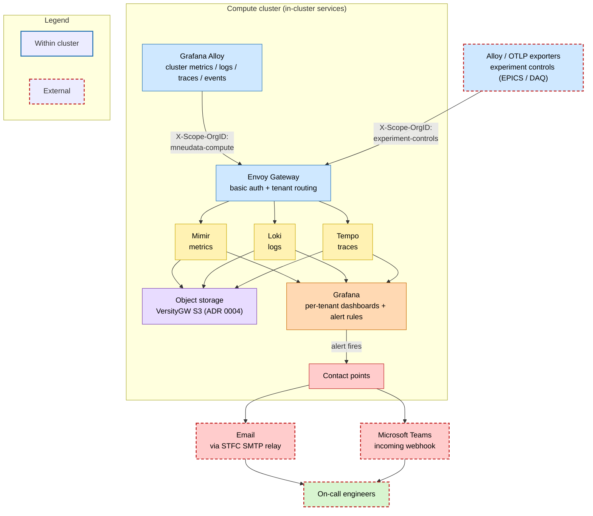

<!-- Implementation notes:
- Self-hosted full LGTM stack rather than a SaaS: Loki (logs, chart 18.8.0 distributed), Grafana (dashboards/alerts, 13.1.0), Mimir (metrics, mimir-distributed 6.2.0), Tempo (traces, tempo-distributed 2.26.2) — each its own GitOps app, all sharing on-prem VersityGW S3 for long-term blocks (loki-s3, mimir-s3, tempo-s3, + ruler buckets).
- Collection is Grafana Alloy via the k8s-monitoring chart (v4.5.0) with four roles: alloy-metrics (clustered StatefulSet: cAdvisor/kubelet/kube-state-metrics/node-exporter + Prometheus Operator ServiceMonitors/PodMonitors/Probes), alloy-logs (DaemonSet tailing container logs), alloy-singleton (cluster events + annotation autodiscovery), alloy-receiver (in-cluster OTLP on 4317/4318).
- Everything is scoped to tenant 'mneudata-compute' and pushed OUT through the Envoy Gateway edge (mimir/loki/tempo.compute.isis.cclrc.ac.uk/mneudata-compute) using basic-auth secrets (mimir/loki/tempo-basic-auth in monitoring-system) with tls.insecureSkipVerify=true — i.e. Alloy talks to the stack via the same authenticated public path as external clients.
- Collection is deliberately tuned/filtered: an explicit monitored-namespace allowlist, cAdvisor/kubelet metric drop lists, node-exporter netdev/filesystem filters, and a log stage dropping successful health/readiness probe lines — to keep S3 storage and cardinality under control.
- HA/quorum constraints baked in: Loki replication_factor=3 forces ingester.autoscaling.minReplicas=2 (1 replica => 500s on ingest); Mimir uses a Kafka KRaft ingest buffer on local-path storage; Mimir/Loki components mounting SMB need supplementalGroups [1000].
- Grafana runs 3 stateless replicas backed by the CloudNativePG PostgreSQL 17 cluster (persistence off, DB password injected from grafana-db-creds), with sidecars auto-loading ConfigMaps labelled grafana_datasource/grafana_dashboard and SMTP alert routing via the STFC relay.
- Data sources are provisioned for full correlation: Mimir (default metrics, exemplars -> Tempo), Loki (derived trace-ID fields -> Tempo), Tempo (trace-to-logs -> Loki, service graph -> Mimir); Tempo's metrics-generator remote-writes derived metrics into Mimir with X-Scope-OrgID mneudata-compute.
- Rationale: keep all telemetry on-prem/tenant-isolated, correlate logs+metrics+traces in one Grafana, and reuse the cluster's own S3/Postgres/Gateway so observability has no external dependency.
-->
# 7. Monitoring and alerting

Date: 2026-08-06
## Status

First Draft

## Context

The cluster and its workloads need to be observable — metrics, logs, and traces, with alerting and incident investigation — without a separate tool per signal.

What we want:

- unified correlation: logs, metrics, and traces in one pane, not three disconnected tools
- self-hosted and on-network: telemetry stays on our own infrastructure, resilient and reachable during a beam cycle (as with storage in ADR 0004)
- multi-tenancy: teams and experiments share the stack with their data isolated
- scale and cost control: scalable stores on cheap object storage, with retention and cardinality managed.

## Decision

We will run a full, self-hosted Grafana "LGTM" stack, fed by Grafana Alloy collectors and stored on our own object storage:

- Metrics: Mimir — scalable, multi-tenant long-term store (rejected plain Prometheus: no scalable store or native multi-tenancy).
- Logs: Loki — label-indexed logs on the same object storage (rejected ELK/EFK: heavier and index-heavy for our volumes).
- Traces: Tempo — object-storage tracing that correlates with logs and metrics (rejected Jaeger: less clean integration).
- Dashboards and alerting: Grafana — one pane for all three signals, with cross-links and alerting to email/MS Teams.
- Collection: Grafana Alloy — gathers metrics, logs, events, and OTLP telemetry and ships them to the stores.
- Multi-tenancy: each tenant is separated by a per-tenant org ID on ingest and query.
- Storage: telemetry blocks live on our own S3 (VersityGW), backed by ISIS storage (ADR 0004).

External options were rejected briefly: SaaS such as Grafana Cloud or Datadog moves telemetry off-site with recurring cost and a cycle-time external dependency; a central STFC/ISIS monitoring service was not chosen because we want the data on our own network and integrated with this cluster.

How the pieces fit together — multiple tenants feeding a shared stack, and Grafana alerting to on-call engineers — is shown below:

## Consequences

We get a single, correlated view of health — logs, metrics, and traces in one place — on our own network and reachable through a beam cycle, with no per-signal tool sprawl and one Grafana skillset.

The trade-offs:

- Self-hosting: we operate, scale, and patch several distributed components ourselves, with no vendor to fall back on.
- Sharing the object-storage foundation (ADR 0004) potentially ties monitoring's health to that storage's health.
