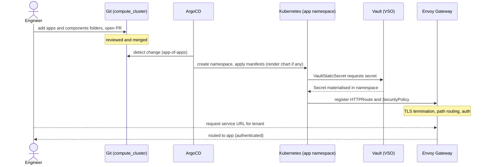
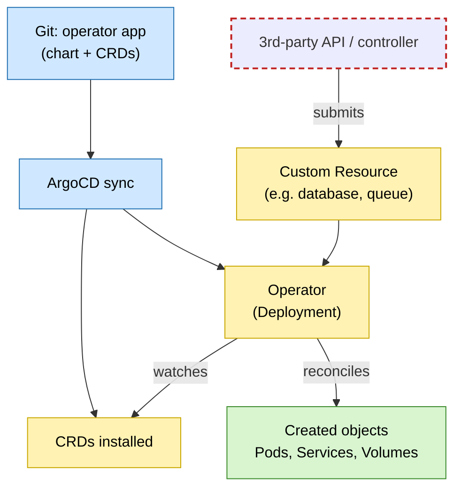

# 8. Deploying software on the infrastructure

## Context and Problem Statement

This ADR builds on the GitOps engine and reconciliation model of ADR 0006, and the networking and ingress stack of ADR 0005. Where 0006 decides *how the cluster is managed* (git as source of truth, ArgoCD, operators/CRDs), this ADR defines *the repeatable convention for packaging and exposing an individual application* on top of that engine. We will deploy many applications over time — both third-party and in-house — so how should an app be packaged, isolated, exposed, authenticated, and given secrets, without bespoke wiring each time?

## Decision Outcome

Every app is deployed declaratively as an ArgoCD Application under the `infra` project, following one convention rather than per-app wiring:

* Packaging (third-party): a multi-source Application pulling the upstream Helm chart or manifests, overlaid with our `values.yml`/patches and, where needed, our supporting manifests.
* Packaging (in-house): an Application deploying our own manifests (plain YAML or Kustomize) straight from the repository, with no upstream chart.
* Repository layout: `apps/<app>` holds the Application (plus `values.yml` for chart-based apps); `components/<app>` holds our own manifests (or the whole app for in-house software). Adding an app is adding these folders — the app-of-apps picks it up.
* Isolation: each app runs in its own namespace.
* External exposure (only where needed): an HTTPRoute on the shared Gateway with TLS terminated there, using either a hostname per service (e.g. web UIs) or a per-tenant path prefix with a tenant org-ID header injected (multi-tenant ingest such as the LGTM stack).
* Edge authentication (where appropriate): a SecurityPolicy on the route enforces auth at the Gateway.
* Secrets (where needed): delivered at runtime by a VaultStaticSecret, never committed to git.

Alternatives considered and rejected:

* Bespoke per-app wiring — rejected because it drifts into inconsistency and loses the benefits of a predictable, reviewable pattern.
* A scaffolding tool (Helm umbrella chart / Kustomize bases / cookiecutter) — not adopted for now; the folder convention is simpler and the app-of-apps already provides discovery, though a scaffold could layer on later.
* Per-app Ingress/LoadBalancer — rejected in favour of the single shared Gateway, so TLS, routing, and auth are centralised rather than reimplemented per app.

A future direction (not decided here) is a self-service developer portal such as Backstage, to let engineers deploy software without hand-editing the repository.

### Repository layout

The `gitops/` tree is split by role — `apps/` holds ArgoCD Applications, `components/` holds our own manifests, `projects/` holds AppProjects:

```text
gitops/
├─ apps/                     # app-of-apps recurses here; one folder = one Application
│  ├─ app-of-apps/            # root Application -> recurses apps/
│  ├─ grafana/                # third-party: upstream chart + values.yml + components/grafana
│  └─ s3-exporter/            # in-house: deploys components/s3-exporter (no chart)
│
├─ components/               # our own manifests; one folder per app
│  ├─ grafana/                # supporting manifests (datasources, routes, secrets)
│  └─ s3-exporter/            # the whole in-house app (deployment, service, ...)
│
└─ projects/
   └─ infra.yml              # ArgoCD AppProject all apps run under
```

- `apps/app-of-apps` recurses `apps/` and manages every other Application; `apps/app-of-projects` does the same for `projects/`.
- A third-party app (e.g. `grafana`) pulls its upstream chart, overlays `apps/grafana/values.yml`, and adds the manifests in `components/grafana/`.
- An in-house app (e.g. `s3-exporter`) has no chart — its Application simply deploys the manifests in `components/s3-exporter/`.
- Every Application runs under the `infra` AppProject in `projects/infra.yml`.

### Example: deploying an application

Getting a new service running, from a git change to a served request. This example is a chart-based, exposed app needing a secret; simpler apps skip the chart, Gateway, or Vault steps:



### Example: operator-managed software

Some software is deployed via an operator. ArgoCD deploys the operator and its CRDs from git; thereafter a custom resource — which may be submitted by a third-party API rather than by us — drives the operator to create the underlying objects:



### Consequences

* Good, because onboarding a new application becomes routine and reproducible: contributors follow one pattern, upstream software stays cleanly separated from our configuration, and the whole deployment is described in git and rebuildable.
* Bad, because centralising exposure, TLS, and auth at the Gateway keeps apps simple but makes the Gateway and its policies a shared, critical piece that every externally-exposed app depends on.
* Bad, because runtime secret delivery keeps git clean but puts Vault and the secrets operator on the critical path to deploy and run an app.
* Bad, because for operator-managed software not every running object comes from git (see ADR 0006), so what is declared and what is created can differ, and ArgoCD must tolerate operator- and API-created objects.

### Confirmation

A new app appears once its `apps/`/`components/` folders are merged and the app-of-apps reconciles it (`kubectl get applications -n argocd`). External exposure and auth are verifiable with `kubectl get httproute,securitypolicy -A` and a `curl` to the service URL (expecting a 401 on protected tenant paths); secrets are present in-namespace via `VaultStaticSecret` while absent from the repository.
