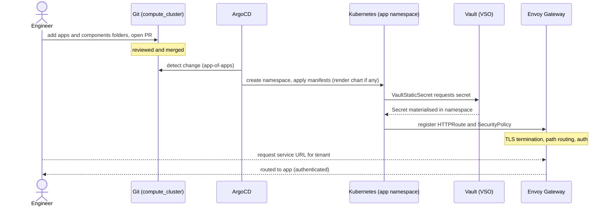
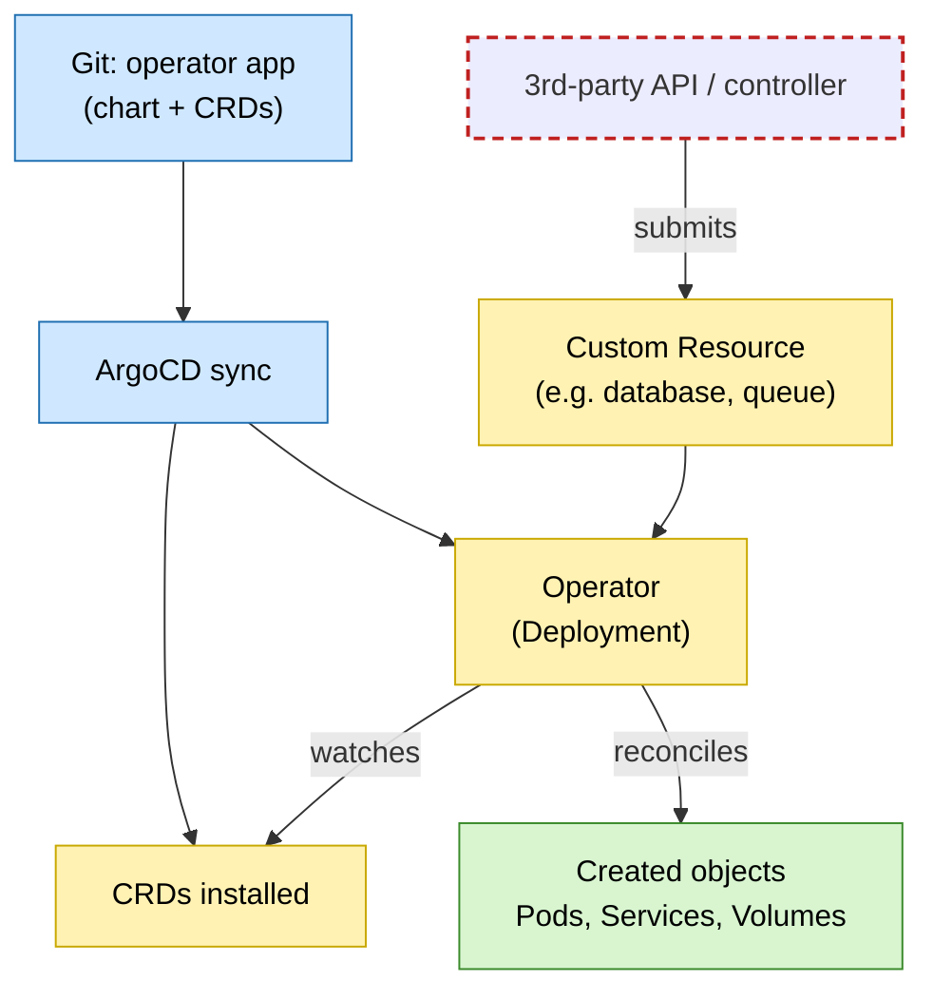

<!-- Implementation notes:
- Every workload is deployed purely declaratively as an ArgoCD Application under the 'infra' project — no manual kubectl/helm installs on the cluster; adding software = adding a folder under gitops/apps/ that the app-of-apps picks up automatically.
- Consistent two-part layout per app: gitops/apps/<app>/ holds the Application (multi-source Helm) + values.yml, and gitops/components/<app>/ holds our supporting Kubernetes manifests (routes, SecurityPolicies, PVs/PVCs, Vault secrets, etc.); this keeps upstream chart config separate from cluster-specific glue.
- Each app gets its own namespace (auto-created via CreateNamespace=true) for isolation, and ServerSideApply=true is used for apps with large CRDs/field-ownership needs.
- External access is standardised: an HTTPRoute per tenant path attaches to the single shared Gateway, matches PathPrefix /<tenant> (e.g. /mneudata-compute), uses URLRewrite ReplacePrefixMatch:/ to strip the prefix, and a RequestHeaderModifier to inject X-Scope-OrgID:<tenant> for multi-tenant backends — with TLS terminated at the Gateway.
- Edge auth is per-route: an Envoy Gateway SecurityPolicy targets the tenant HTTPRoute and enforces SHA-hashed HTTP basic auth (bcrypt unsupported), so security is applied uniformly at the ingress rather than per-app.
- Secrets are never in git: they are delivered by VaultStaticSecret objects (kv-v2, vaultAuthRef static-auth, mount isis-compute-cluster, e.g. path loki/user-basic-auth/mneudata) that materialise Kubernetes Secrets in the app namespace with periodic refresh.
- Rationale: a uniform, template-like deployment pattern (Application + values + components + HTTPRoute + SecurityPolicy + VaultStaticSecret) makes onboarding new services predictable, reviewable, and fully reproducible from git.
-->
# 8. Deploying software on the infrastructure

Date: 2026-09-11
## Status

First Draft

## Context

This ADR builds on the GitOps engine and reconciliation model established in ADR 0006, and the networking and ingress stack in ADR 0005. Where 0006 decides *how the cluster is managed* (git as source of truth, ArgoCD, operators/CRDs), this ADR defines *the repeatable convention for packaging and exposing an individual application* on top of that engine.

We will deploy many applications over time — both third-party and in-house — so we want:

- a predictable, template-like pattern, not bespoke wiring per app
- separation between the software (upstream chart or our own manifests) and our cluster-specific configuration
- isolation between applications
- consistent external exposure, TLS, and authentication for the apps that need them
- no secrets in the repository.

## Decision

Every app is deployed declaratively as an ArgoCD Application under the `infra` project, but packaging depends on where the software comes from:

- Packaging (third-party): a multi-source Application pulling the upstream Helm chart or manifests, overlaid with our values.yaml/patches and, where needed, our supporting manifests.
- Packaging (in-house): an Application deploying our own manifests (plain YAML or Kustomize) straight from the repository, with no upstream chart.
- Repository layout: `apps/<app>` holds the Application (plus `values.yml` for chart-based apps); `components/<app>` holds our own manifests (or the whole app for in-house software). Adding an app is adding these folders — the app-of-apps picks it up.
- Isolation: each app runs in its own namespace.
- External exposure (only where needed): an HTTPRoute on the shared Gateway with TLS terminated there, using either a hostname per service (e.g. web UIs) or a per-tenant path prefix with a tenant org-ID header injected (multi-tenant ingest such as the LGTM stack).
- Edge authentication (where appropriate): a SecurityPolicy on the route enforces auth at the Gateway.
- Secrets (where needed): delivered at runtime by a VaultStaticSecret, never committed to git.

### Repository layout

The `gitops/` tree is split by role — `apps/` holds ArgoCD Applications, `components/` holds our own manifests, `projects/` holds AppProjects:

```text
gitops/
├─ apps/                     # app-of-apps recurses here; one folder = one Application
│  ├─ app-of-apps/            # root Application -> recurses apps/
│  ├─ grafana/                # third-party: upstream chart + values.yml + components/grafana
│  └─ s3-exporter/            # in-house: deploys components/s3-exporter (no chart)
│
├─ components/               # our own manifests; one folder per app
│  ├─ grafana/                # supporting manifests (datasources, routes, secrets)
│  └─ s3-exporter/            # the whole in-house app (deployment, service, ...)
│
└─ projects/
   └─ infra.yml              # ArgoCD AppProject all apps run under
```

How the pieces link together:

- `apps/app-of-apps` recurses `apps/` and manages every other Application; `apps/app-of-projects` does the same for `projects/`.
- A third-party app (e.g. `grafana`) pulls its upstream chart, overlays `apps/grafana/values.yml`, and adds the manifests in `components/grafana/`.
- An in-house app (e.g. `s3-exporter`) has no chart — its Application simply deploys the manifests in `components/s3-exporter/`.
- Every Application runs under the `infra` AppProject in `projects/infra.yml`.

### Example: deploying an application

Getting a new service running, from a git change to a served request. This example is a chart-based, exposed app needing a secret; simpler apps skip the chart, Gateway, or Vault steps:



### Example: operator-managed software

Some software is deployed via an operator. ArgoCD deploys the operator and its CRDs from git; thereafter a custom resource — which may be submitted by a third-party API rather than by us — drives the operator to create the underlying objects:



## Consequences

Onboarding a new application becomes routine and reproducible: contributors follow one pattern, upstream software stays cleanly separated from our configuration, and the whole deployment is described in git and rebuildable.

There may be much further work here to simplify deployment processes for software engineers. For example, using Backstage as a Developer Portal with the appropriate setup to allow a developer to trivially deploy that software.

The trade-offs:

- The convention has to be followed to work: apps that ignore the `apps`/`components` layout or the shared routing/auth pattern lose its benefits and add inconsistency.
- Centralising exposure, TLS, and auth at the Gateway keeps apps simple but makes the Gateway and its policies a shared, critical piece that every cluster externally exposed app depends on.
- Runtime secret delivery keeps git clean but puts Vault and the secrets operator as a critical component required to function in order to deploy and run an app.
- For operator-managed software, not every running object comes from git (see ADR 0006), so what is declared and what is created can differ, and ArgoCD must tolerate operator and API-created objects.

