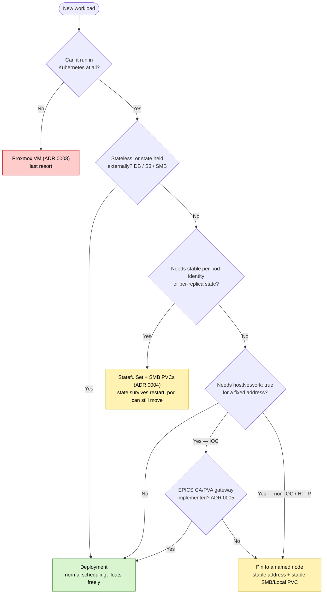

# 9. Software that can't restart or move

## Context and Problem Statement

Kubernetes assumes pods are cattle, freely rescheduled onto any node. Some workloads resist this: those with a node-tied network identity (`hostNetwork: true`, e.g. EPICS IOCs whose clients target a fixed node IP), and those holding state that must survive a restart or reschedule. We want each workload at the *least* constrained placement it can tolerate, only pinning or leaving Kubernetes when forced. How do we decide where a given piece of software resides?

## Decision Drivers

* Prefer the least-constrained placement a workload can tolerate.
* Keep workloads reachable at a stable address when they cannot float.
* Preserve state on network-backed (SMB) storage rather than node-local disk.
* Stay in the Kubernetes/GitOps model where possible, with a last-resort escape hatch.

## Considered Options

* Normal Kubernetes scheduling (Deployment), with IOCs fronted by an EPICS CA/PVA Gateway so they float
* StatefulSet with SMB-backed PVCs, for stable per-pod identity and per-replica state
* Node pinning to a named node, for `hostNetwork` workloads a gateway cannot front
* Proxmox VM/container, outside Kubernetes

## Decision Outcome

Chosen approach: place each workload at the **highest-preference tier it can tolerate**, in this order.

1. **Deployment (normal scheduling) - first preference.** Stateless workloads, or those with externalised state (PostgreSQL, S3, or an SMB-backed PVC from ADR 0004), float freely. IOCs join this tier when fronted by an EPICS CA/PVA Gateway (ADR 0005), which gives a stable address while pods drop `hostNetwork` (keeping them under `restricted` PSA).
2. **StatefulSet - second preference,** where a Deployment does not fit and a workload needs stable per-pod identity plus per-replica state (e.g. a clustered database or Kafka/Zookeeper-style broker). SMB-backed PVCs (ADR 0004) keep state across restarts while still letting the pod move between nodes.
3. **Pin to a named node - third preference,** only where a gateway is insufficient and `hostNetwork: true` is required (a non-IOC needing `hostNetwork`, or un-gatewayable HTTP). Node selector / affinity holds the address constant; state uses a stable SMB PVC. This trades automatic failover for a stable address.
4. **Proxmox VM - last resort,** when the software cannot live in Kubernetes at all: run it directly on Proxmox (ADR 0003), outside Kubernetes/GitOps.

The decision path for placing a new workload:

### Consequences

* Good, because most workloads float freely with automatic failover and keep state on network-backed SMB rather than node-local disk.
* Good, because a CA/PVA gateway moves IOCs to the floating tier, shrinking what must be pinned and improving their posture (no `hostNetwork`, `restricted` PSA).
* Bad, because pinned workloads (tier 3) lose automatic failover and must be tracked (which app is pinned where).
* Bad, because the Proxmox VM (tier 4) sits outside Kubernetes/GitOps, managed and observed separately.

### Confirmation

`kubectl get pods -o wide` shows a Deployment rescheduling across nodes while its SMB PVC keeps state, and a StatefulSet's replicas keeping identity/PVC across restarts. A pinned pod lands on its named node (IOC `caget` works after restart); a gateway-fronted IOC stays reachable while its pod is rescheduled.

## Pros and Cons of the Options

### Deployment (normal scheduling) - first preference

* Good, because it is the standard model with automatic failover, and (behind a CA/PVA gateway) lets even IOCs float without `hostNetwork`; externalised state (DB / S3 / SMB PVC, ADR 0004) is not node-tied.
* Bad, because for IOCs it depends on the gateway, adding a hop and CA/PVA semantics (caching, beacon/search) to reason about.

### StatefulSet with SMB-backed PVCs - second preference

* Good, because stable per-pod identity + per-replica SMB PVCs suit clustered databases/brokers, with state surviving restarts while the pod can still move nodes.
* Bad, because it is more complex than a Deployment and inherits SMB's characteristics.

### Node pinning to a named node - third preference

* Good, because the node IP stays constant for a `hostNetwork` workload a gateway cannot front.
* Bad, because it removes automatic failover and makes placement something we track and work around.

### Proxmox VM/container, outside Kubernetes - last resort

* Good, because it handles workloads that cannot live in Kubernetes, reusing the virtualisation layer (ADR 0003).
* Bad, because it is deployed, managed, and observed outside Kubernetes/GitOps.
